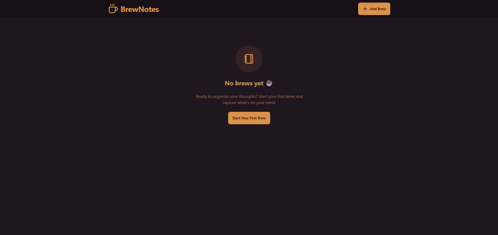
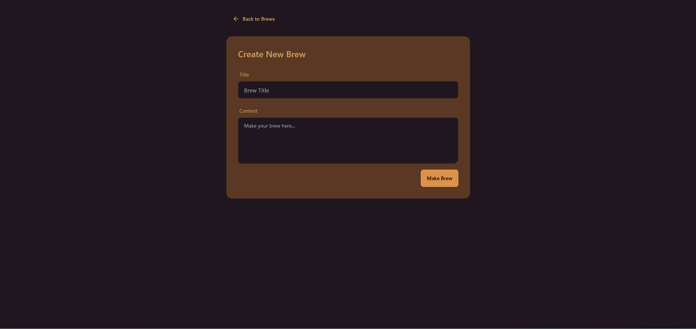
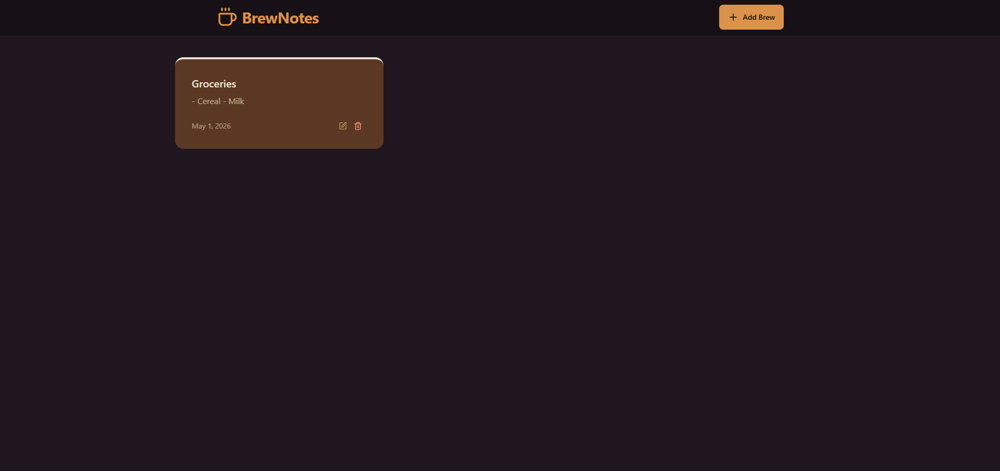

# BrewNotes

## Table of Contents

<!-- prettier-ignore-start -->

- [About the Project](#about-the-project)<br>
- [Demo](#demo)<br>
- [Tech Stacks](#tech-stacks)<br>
- [Setup](#setup)<br>
  - [Prequisites](#prequisites)<br>
  - [Installation](#installation)<br>
- [Repository Structures](#repository-structures)<br>
<!-- prettier-ignore-end -->

---

## About the Project

<table>
<tr>
<td></td>
<td></td>
<td></td>
</tr>
</table>

BrewNotes is a coffee-themed note taking app created with MERN stack. The idea came from developers loving coffee and spending time working at cafes. The app is meant to feel like being in a cafe while taking notes. The app is also responsive on mobile and tablet as well.

---

## Demo

You can access the app [here](https://catalog-app-r0on.onrender.com/).

---

## Tech Stacks

- Frontend: Vite + TailwindCSS
- Language: JavaScript
- Backend: Node + Express
- Database: MongoDB
- Rate Limit Feature: Upstash
- Hosting: Render

---

## Setup

### Prequisites

- Node 22+
- MongoDB Project (Database)
- Upstash Workflow (Redis)

### Installation

1. Clone the Repository

```
git clone https://github.com/abdulgilani/brewnotes
```

2. Install Dependencies

```
cd backend && npm i
cd ../frontend && npm i
```

3. Environmnent Setup

```
cp backend/.env.example backend/.env
```

Update `.env` with your configurations

- MongoDB URI
- Upstash Redis REST URL
- Upstash Redis REST Token

4. Development

```
# Run the backend
cd backend && npm run dev

# Run the frontend
cd frontend && npm run dev
```

5. Production Build

```
npm run build
npm run start
```

Visit http://localhost:5001/api

## Repository Structures

```
/brewnotes
├── .gitignore
├── README.md
├── /backend
│   ├── .env.example
│   └── src
│       ├── /config                                    # Upstash and DBconfigs
│       ├── /controller                                # Endpoint controllers (getAllNotes, getNotes, postNote, updateNote, deleteNote)
│       ├── index.js                                   # Main express server entry
│       ├── /middleware                                # Rate limiting middleware
│       ├── /model                                     # Model to create the database in the MongoDB project cluster
│       └── /routes                                    # Endpoints routes to get to controllers
├── /frontend
│   ├── README.md
│   ├── coffee.svg
│   ├── eslint.config.js
│   ├── index.html
│   ├── src
│   │   ├── App.jsx                                    # Main routing setup
│   │   ├── /components                                # UI Components (Navbar, NoteCard, NotesNotFound, RateLimit)
│   │   ├── index.css                                  # Tailwind configuration page
│   │   ├── /lib                                       # Config files (axios, utils)
│   │   ├── main.jsx                                   # React entry point
│   │   └── /pages                                     # App Pages (CreateHomePage, HomePage, NoteDetailPage)
│   ├── tailwind.config.js
│   └── vite.config.js
└── package.json
```
